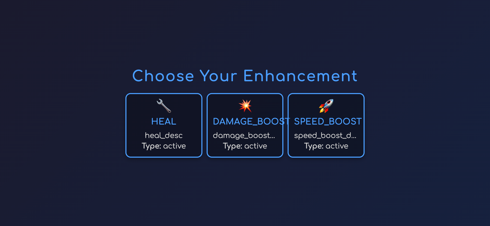
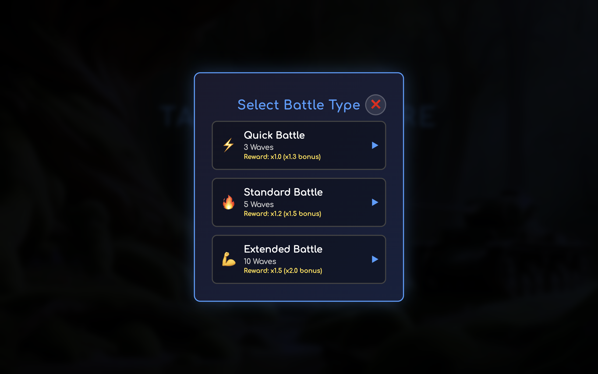
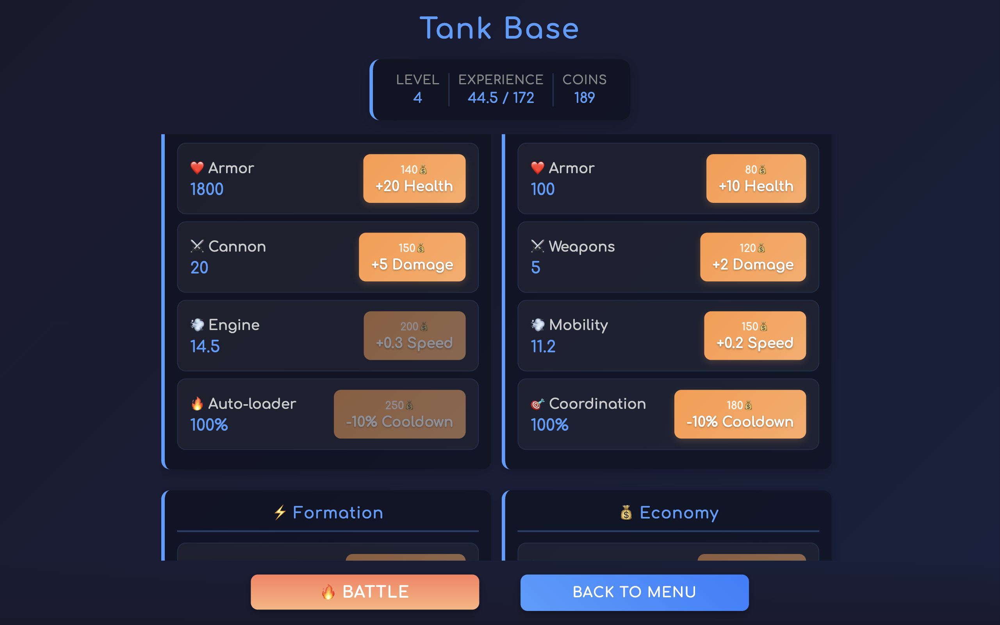
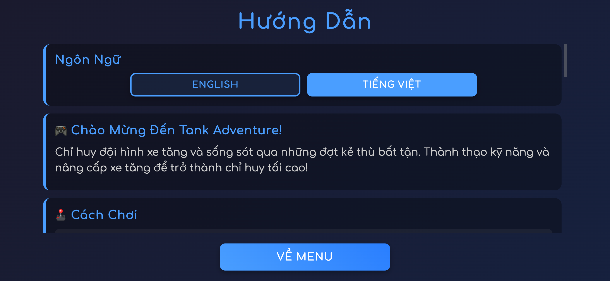

# Tank Adventure Game

A complete 2D tank battle game designed for mobile and tablet devices with touch controls.

## Video Demo

[](https://www.youtube.com/watch?v=W1IO_qIPe9g)

🎮 **[Watch Gameplay Video](https://www.youtube.com/watch?v=W1IO_qIPe9g)** - See the tank battle action in motion!

## Screenshots

#### PWA Builder


#### Main Menu


#### Battle Field


#### Skill Selection


#### Battle Type


#### Base & Upgrades


#### Multi-Languages



## Features

### Core Gameplay
- **Player Tank Formation**: Control a main tank with 5 mini tanks in synchronized formation
- **Wave-Based Combat**: Battle against increasingly difficult enemy waves
- **Skill System**: Choose from active and passive skills between waves
- **Auto-Combat**: Mini tanks automatically engage enemies while you focus on movement
- **Progressive Difficulty**: Enemies become stronger and more diverse with each wave

### Mobile-Optimized Controls
- **Virtual Joystick**: Smooth movement control on bottom-left
- **Action Buttons**: Primary shoot and skill buttons on bottom-right
- **Touch-Friendly UI**: All interfaces designed for finger interaction
- **Responsive Design**: Adapts to various screen sizes and orientations

### Progression System
- **Tank Upgrades**: Improve health, damage, speed, and firing rate
- **Formation Expansion**: Add up to 3 additional mini tanks
- **Skill Tree**: Unlock and upgrade various combat abilities
- **Economy System**: Earn coins to purchase upgrades
- **Experience Levels**: Gain experience to unlock new content

### Game Modes
- **Battle Mode**: Wave-based combat with skill selection
- **Base Screen**: Upgrade tanks and manage resources
- **Skill Selection**: Choose enhancements between waves

## File Structure

```
tank-adventure/
├── docs/
│   └── game-architecture.md     # Technical documentation
├── tests/
│   ├── test-*.html             # HTML test files
│   ├── verify-*.js             # JavaScript verification files
│   └── README.md               # Test documentation
├── css/
│   └── game.css                # All game styles
├── js/
│   ├── game-engine.js          # Main game loop and state management
│   ├── player.js               # Player and tank systems
│   ├── enemy.js                # Enemy AI and wave management
│   ├── skills.js               # Skill system and effects
│   ├── ui.js                   # User interface and mobile controls
│   ├── upgrades.js             # Upgrade system
│   └── utils.js                # Utility functions
├── assets/                     # Game assets (images, sounds)
├── index.html                  # Main game page
├── requirement.txt             # Game requirements specification
└── README.md                   # This file
```

## Getting Started

1. **Open the game**: Navigate to `index.html` in a web browser
2. **Mobile/Tablet**: For best experience, open on mobile device or use browser dev tools mobile emulation
3. **Controls**:
   - Use virtual joystick (bottom-left) to move your tank formation
   - Tap PRIMARY SHOOT button to fire main tank
   - Tap SKILL buttons to manually activate skills (or let them auto-cast)

## Game Mechanics

### Tank System
- **Main Tank**: Large, powerful tank that you directly control
- **Mini Tanks**: 5 smaller tanks that follow in formation and auto-attack
- **Formation Movement**: All tanks move together maintaining formation
- **Individual Health**: Each tank has its own health and can be destroyed independently

### Enemy Types
- **Basic**: Standard enemies with balanced stats
- **Heavy**: Slow but heavily armored with high damage
- **Fast**: Quick enemies that use hit-and-run tactics
- **Sniper**: Long-range enemies that prefer to keep distance
- **Boss**: Powerful enemies with complex AI patterns (every 5 waves)

### Skills
- **Active Skills**: Powerful abilities with cooldowns (auto-cast by default)
  - Emergency Repair: Instant healing
  - Combat Overdrive: Damage boost
  - Nitro Boost: Speed increase
  - Energy Shield: Temporary protection
  - Explosive Rounds: Area damage bullets
  - Multi-Cannon: Fire multiple shots
  - Temporal Field: Slow all enemies
  - Auto-Repair System: Gradual healing over time

- **Passive Skills**: Permanent improvements
  - Reinforced Armor: Increased max health
  - Enhanced Weapons: Higher damage output
  - Improved Engine: Faster movement
  - Rapid Fire System: Reduced cooldowns
  - Advanced Targeting: Better accuracy

### Upgrades
Spend coins earned from battles to permanently improve your tanks:

- **Main Tank**: Health, Damage, Speed, Fire Rate
- **Mini Tanks**: Health, Damage, Speed, Coordination
- **Formation**: Add up to 3 additional mini tanks
- **Special**: Bullet speed, auto-repair, shields, multi-shot chance
- **Economy**: Increase coin and experience gains

## Technical Details

- **Platform**: HTML5 Canvas with JavaScript
- **Rendering**: 2D graphics at 60 FPS target
- **Input**: Touch events for mobile, mouse events for desktop
- **Storage**: LocalStorage for progress persistence
- **Performance**: Optimized for mobile devices

## Browser Compatibility

- Modern mobile browsers (iOS Safari, Chrome Mobile, Firefox Mobile)
- Desktop browsers for development/testing
- Requires JavaScript enabled
- Canvas 2D support required

## Development

The game is built with vanilla JavaScript and HTML5 Canvas for maximum compatibility and performance on mobile devices. No external dependencies or build process required.

### Debug Functions
Open browser console and use:
- `debugGame()` - Toggle debug mode
- `resetGame()` - Reset all progress

## Sentry - Error Log Tracking

[**Issues Page**](https://sereneai.sentry.io/issues/6728315935/?project=4509615414640640)

[**Insights Page**](https://sereneai.sentry.io/issues/6728315935/?project=4509615414640640)

Developed as a complete mobile tank battle game implementing modern game development patterns and mobile-first design principles.

## License

Copyright © 2025 Monk Journey Team. All Rights Reserved.

This project is proprietary and confidential. Unauthorized reproduction, distribution, or disclosure is prohibited. No license, express or implied, to any intellectual property rights is granted by this document.

See the [LICENSE](LICENSE) file for full details.
