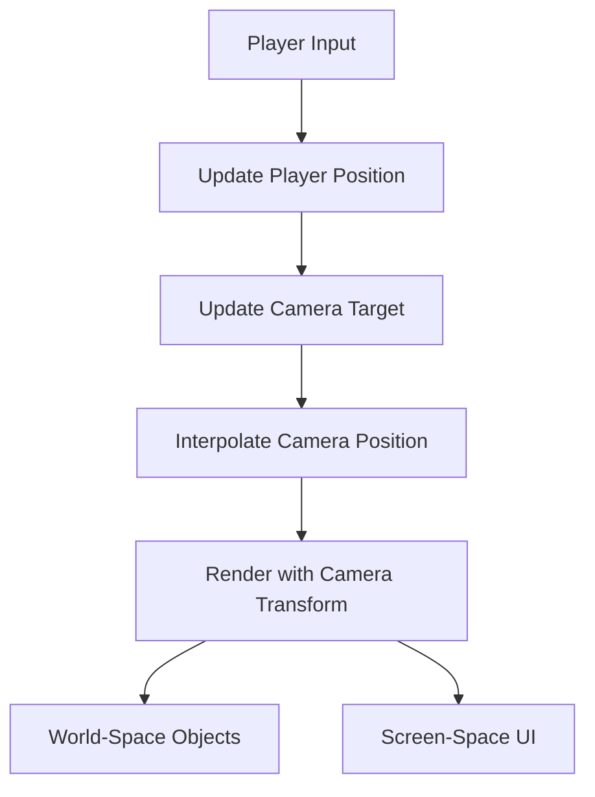

# Tank Adventure - Enhancements v2.0

## Overview
Enhanced the tank adventure game with three major improvements focusing on auto-aim, skill selection, and endless movement with camera follow.

## 1. Auto-Aim System

### Features
- **Manual Trigger**: Main tank only shoots when player presses the shoot button
- **Automatic Targeting**: When shooting, automatically aims at the nearest enemy
- **Smart Fallback**: If no enemies are present, shoots in the current facing direction
- **Mini Tank Independence**: Mini tanks continue to auto-shoot independently

### Implementation
```javascript
// In Player class
manualShoot(targetX = null, targetY = null, enemies = []) {
    if (this.autoAimEnabled && enemies.length > 0) {
        const nearestEnemy = this.findNearestEnemy(enemies);
        if (nearestEnemy) {
            this.mainTank.shoot(nearestEnemy.x, nearestEnemy.y);
            return;
        }
    }
    // Fallback to manual targeting
    this.mainTank.shoot(targetX, targetY);
}
```

## 2. Enhanced Wave System

### Changes
- **Single Skill Selection**: Only 1 skill choice per wave completion (instead of 3)
- **More Enemies**: Increased from `5 + wave*2` to `10 + wave*3` enemies per wave
- **Faster Spawning**: Reduced spawn intervals for more intense battles
- **Max Enemies**: Increased cap from 25 to 40 enemies per wave

### Formula
```javascript
this.totalEnemiesInWave = Math.min(10 + waveNumber * 3, 40);
this.spawnInterval = Math.max(800, 2200 - waveNumber * 80);
```

## 3. Endless Movement with Camera Follow

### Camera System
```javascript
// Camera follows player smoothly
this.camera = {
    x: 0, y: 0,              // Current camera position
    targetX: 0, targetY: 0,   // Target position (player-centered)
    smoothing: 0.1            // Smooth follow factor
};
```

### Key Features
- **Infinite World**: No movement boundaries for player or enemies
- **Smooth Camera**: Camera smoothly follows player with interpolation
- **Dynamic Background**: Infinite grid pattern that moves with camera
- **World-Space Rendering**: All game objects rendered in world coordinates
- **Screen-Space UI**: UI elements remain fixed on screen

### Implementation Flow


## Technical Details

### Rendering Pipeline
1. **Clear Canvas**
2. **Apply Camera Transform**: `ctx.translate(-camera.x, -camera.y)`
3. **Render World Objects**: Background, player, enemies, effects
4. **Restore Transform**
5. **Render UI**: Fixed screen-space elements

### Enemy Spawning
- Enemies spawn in a circle around the player at ~400px distance
- No longer constrained to screen edges
- Maintains proper challenge scaling with wave progression

### Boundary Removal
- Removed all `Utils.clamp()` calls for position constraints
- Bullets expire by time only (not screen bounds)
- Tanks can move freely in any direction

## Benefits

1. **Enhanced Gameplay**: Auto-aim reduces manual precision while maintaining player control
2. **Streamlined Progression**: Single skill choice speeds up game flow
3. **Increased Challenge**: More enemies create more intense battles
4. **Freedom of Movement**: Endless world removes artificial constraints
5. **Improved UX**: Smooth camera follow keeps player centered and oriented

## Performance Considerations

- **Infinite Background**: Grid only renders visible area
- **Bullet Cleanup**: Time-based expiration prevents infinite accumulation
- **Enemy Culling**: Could be added for very distant enemies if needed
- **Camera Smoothing**: Prevents jarring movements and motion sickness

## Future Enhancements

1. **Smart Enemy Culling**: Remove enemies too far from player
2. **Dynamic Spawn Rates**: Adjust based on current enemy count
3. **Biome System**: Different background patterns for world variety
4. **Minimap**: Show player position and nearby enemies