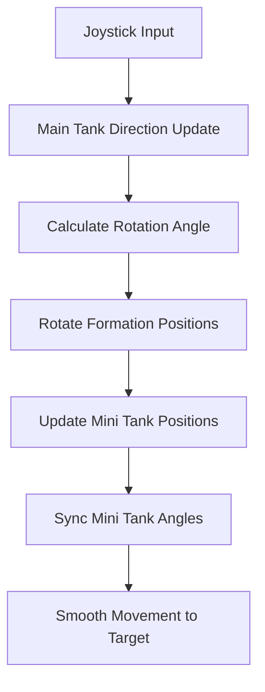

# Tank Formation Rotation Diagram

## Formation Layout and Rotation Behavior

### Base Formation Positions
```
    M5 (0, -80)
    |
M1 ── MT ── M2
(-60,-60)    (60,-60)
    |
M3 ── ── ── M4
(-60,60)    (60,60)
```

### Rotation Transformation
When main tank (MT) rotates, the entire formation rotates around the main tank's center.



## Rotation Examples

### Moving Right (0°)
```
    M5
    ↑
M1→ MT→ M2→
    ↓
M3→ ── M4→
```

### Moving Down-Right (45°)
```
  M5↘
     ↘
M1↘ MT↘ M2↘
      ↘
   M3↘ M4↘
```

### Moving Down (90°)
```
M1↓ M5↓ M2↓
    ↓
    MT↓
    ↓
    M3↓ M4↓
```

### Moving Left (180°)
```
    M5
    ↑
←M2 ←MT ←M1
    ↓
←M4 ── ←M3
```

## Code Flow

### 1. Joystick Input Processing
```javascript
// In game-engine.js
const joystick = this.ui.getJoystickInput();
this.player.setMovementDirection(joystick.x, joystick.y, joystick.magnitude);
```

### 2. Main Tank Direction Update
```javascript
// In player.js - updateMovement()
const movementAngle = Math.atan2(this.moveDirectionY, this.moveDirectionX);
mainTank.targetAngle = movementAngle;
```

### 3. Formation Rotation
```javascript
// In player.js - updateMiniTankFormation()
const rotatedPos = this.rotateFormationPosition(basePos, mainTank.targetAngle);
miniTank.targetAngle = mainTank.targetAngle;
```

### 4. Rotation Mathematics
```javascript
// rotateFormationPosition(position, angle)
const cos = Math.cos(angle);
const sin = Math.sin(angle);

return {
    x: position.x * cos - position.y * sin,
    y: position.x * sin + position.y * cos
};
```

## Visual Feedback

### Before Enhancement
- Mini tanks maintain fixed world orientation
- Formation appears disjointed when moving
- Visual disconnect between movement and tank facing

### After Enhancement
- All tanks face movement direction
- Formation appears unified and coordinated
- Clear visual indication of movement direction
- Professional military-style formation movement

## Performance Considerations

- Rotation calculations are lightweight (basic trigonometry)
- Updates only when main tank direction changes
- Smooth interpolation prevents jarring movements
- No impact on game performance

## Testing Scenarios

1. **8-Direction Movement**: Test all cardinal and diagonal directions
2. **Smooth Rotation**: Verify gradual direction changes
3. **Formation Integrity**: Ensure spacing is maintained
4. **Performance**: Check for smooth 60fps operation
5. **Edge Cases**: Test rapid direction changes