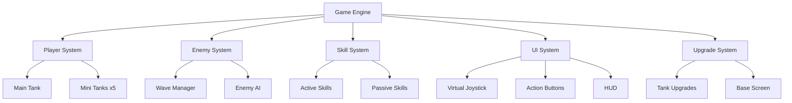

# Tank Adventure - Game Architecture

## System Overview



## Core Components

### 1. Game Engine (game-engine.js)
- Main game loop
- Scene management (Battle, Base, Menu)
- Input handling
- Collision detection
- Rendering coordination

### 2. Player System (player.js)
- Main tank control
- Mini tank coordination
- Movement synchronization
- Health and damage management

### 3. Enemy System (enemy.js)
- Wave-based spawning
- AI behavior patterns
- Difficulty scaling
- Enemy types management

### 4. Skill System (skills.js)
- Active skill auto-casting
- Passive skill effects
- Skill selection interface
- Cooldown management

### 5. UI System (ui.js)
- Virtual joystick implementation
- Action buttons
- HUD display
- Mobile-optimized touch controls

### 6. Upgrade System (upgrades.js)
- Tank stat improvements
- Mini tank enhancements
- Progress persistence
- Economy management

## File Structure

```
tank-adventure/
├── docs/
│   └── game-architecture.md
├── src/
│   ├── index.html
│   ├── css/
│   │   └── game.css
│   ├── js/
│   │   ├── game-engine.js
│   │   ├── player.js
│   │   ├── enemy.js
│   │   ├── skills.js
│   │   ├── ui.js
│   │   ├── upgrades.js
│   │   └── utils.js
│   └── assets/
│       ├── images/
│       └── sounds/
└── requirement.txt
```

## Game Flow

```ascii
Start Game
    ↓
Main Menu
    ↓
Battle Scene
    ↓
┌─────────────────┐
│ Wave 1-10       │
│ ┌─────────────┐ │
│ │ Combat      │ │
│ │ ↓           │ │
│ │ Skill Choice│ │
│ └─────────────┘ │
└─────────────────┘
    ↓
Battle Results
    ↓
Base Screen
    ↓
Upgrades
    ↓
┌─(Loop back to Battle)
```

## Technical Specifications

- **Platform**: Mobile/Tablet (HTML5)
- **Graphics**: 2D Canvas-based rendering
- **Input**: Touch controls (virtual joystick + buttons)
- **Performance**: 60 FPS target
- **Resolution**: Responsive design for various screen sizes
- **Storage**: LocalStorage for game progress