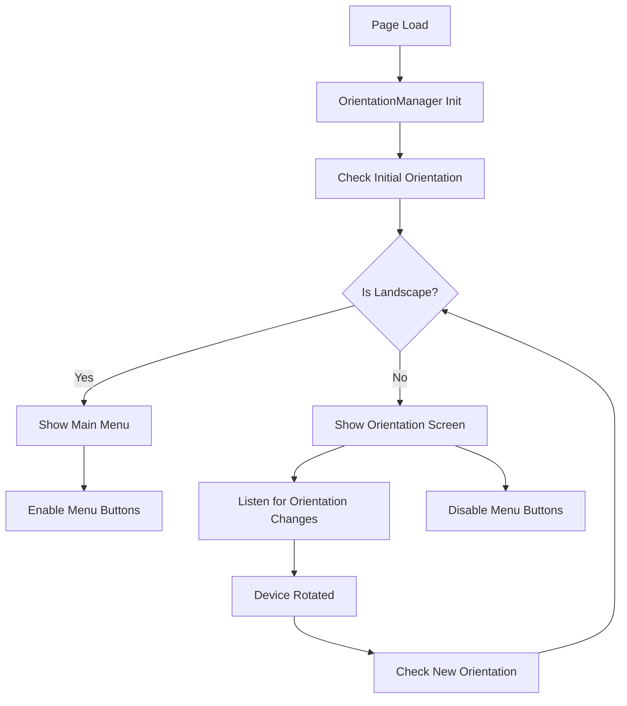

# Orientation System Implementation

## Overview
The orientation system enforces landscape mode for optimal gameplay experience. It prevents users from accessing the main menu and game controls until they rotate their device to landscape orientation.

## Components

### 1. OrientationManager Class (`js/orientation.js`)
- **Purpose**: Manages orientation detection and UI state
- **Key Features**:
  - Multi-method orientation detection (Screen Orientation API, window.orientation, window dimensions)
  - Automatic UI state management
  - Callback system for orientation changes
  - Optional orientation lock capability

### 2. Orientation Screen (`index.html`)
- **Purpose**: Visual guidance for users to rotate their device
- **Features**:
  - Animated SVG icon showing rotation
  - Clear instructions
  - Ghibli-themed styling matching the game
  - Responsive design

### 3. CSS Styling (`css/game.css`)
- **Purpose**: Handles visual states and media queries
- **Features**:
  - Automatic show/hide based on orientation
  - Smooth animations
  - High z-index for priority display
  - Safe area handling for iOS

## Implementation Details

### Orientation Detection Methods

1. **Screen Orientation API** (Primary)
   ```javascript
   screen.orientation.angle === 90 || screen.orientation.angle === -90 ||
   screen.orientation.type.includes('landscape')
   ```

2. **Window Orientation** (Fallback)
   ```javascript
   window.orientation === 90 || window.orientation === -90
   ```

3. **Window Dimensions** (Ultimate Fallback)
   ```javascript
   window.innerWidth > window.innerHeight
   ```

### UI State Management

- **Portrait Mode**: Shows orientation screen, hides main menu, disables menu buttons
- **Landscape Mode**: Hides orientation screen, shows main menu, enables menu buttons

### Event Handling

- `orientationchange` event (with 100ms delay for completion)
- `resize` event (fallback for devices without orientationchange)
- `screen.orientation.change` event (when available)

## Files Modified

1. **`index.html`**
   - Added orientation screen HTML structure
   - Added orientation.js script import

2. **`css/game.css`**
   - Added orientation screen styling
   - Added CSS media queries for automatic orientation handling

3. **`js/orientation.js`** (New file)
   - Complete orientation management system

## Usage

### Basic Usage
The system works automatically once the scripts are loaded:
```html
<script src="js/orientation.js"></script>
```

### Debug Functions
```javascript
// Debug current orientation state
debugOrientation();

// Get detailed orientation info
window.orientationManager.getOrientationInfo();
```

### Callbacks
```javascript
// Listen for orientation changes
window.orientationManager.onOrientationChange((isLandscape) => {
    console.log('Orientation changed:', isLandscape ? 'Landscape' : 'Portrait');
});
```

### Force Landscape (Modern browsers)
```javascript
// Attempt to lock orientation
window.orientationManager.requestLandscape();
```

## Testing

### Test File
- `tests/test-orientation.html` - Comprehensive orientation testing
- Real-time orientation info display
- Manual toggle controls for testing

### Test Instructions
1. Open `tests/test-orientation.html` in browser
2. Rotate device or use browser dev tools to simulate orientation changes
3. Verify that:
   - Orientation screen appears in portrait mode
   - Main menu appears in landscape mode
   - Menu buttons are disabled in portrait mode
   - Transitions are smooth

## Browser Compatibility

- **iOS Safari**: Full support with safe area handling
- **Chrome Mobile**: Full support
- **Firefox Mobile**: Full support
- **Desktop Browsers**: Works for testing (uses window dimensions)

## Implementation Flow



## Benefits

1. **User Experience**: Clear guidance for optimal gameplay
2. **Consistent Layout**: Ensures game elements are properly positioned
3. **Touch Controls**: Optimal joystick and button placement
4. **Visual Quality**: Better aspect ratio for game graphics
5. **Performance**: Landscape mode typically provides better performance

## Customization

### Modify Orientation Requirements
To change which orientations are considered "landscape":
```javascript
// In orientation.js, modify detectLandscape() method
detectLandscape() {
    // Custom logic here
    return customLandscapeCondition;
}
```

### Style Customization
Modify the CSS in `css/game.css` under the `/* Orientation Screen */` section.

### Different Orientation Requirements
To enforce portrait mode instead:
1. Change `detectLandscape()` to `detectPortrait()`
2. Update CSS media queries
3. Modify SVG icon to show portrait orientation

## Future Enhancements

1. **Orientation Lock**: Implement automatic orientation lock when supported
2. **Rotation Animation**: Add smooth rotation animation transitions
3. **Orientation Preferences**: Allow users to set orientation preferences
4. **Tablet Support**: Enhanced tablet-specific orientation handling
5. **Accessibility**: Add screen reader support for orientation instructions